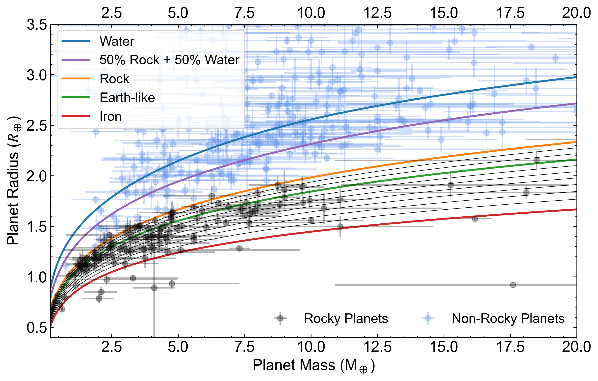

# CORGI

`CORGI` (**C**omposition **O**f **R**ocky, **G**aseous, and **I**cy planets) is a code package for planetary interior simulations. It has several modules useful for simulating the interior composition, structure, and gravity harmonics of all kinds of planets:

- A forward planet interior structure module capable of generating both distinct-layer and empirical density planet models.
- An inverse module for retrieving the possible compositions of a planet given its mass and radius using MCMC.
- A gravity harmonics module adopting the concentric Maclaurin spheroid (CMS) method (Hubbard 2013).

## Requirements
The basic functionalities of `CORGI` depends only on some standard `Python` libraries including `numpy`, `scipy`, `matplotlib`, `pandas`, `datetime`, and `tqdm`. The retrieval module relies on `emcee`. To run some codes in parallel to speed things up, the built-in `multiprocessing` module is helpful.

Below are the versions of my libraries. If you would like to create a new environment for `CORGI` (recommeneded), you can start with this set of libraries (I am using `Python` 3.8.20). Refer to [this link](https://docs.conda.io/projects/conda/en/latest/user-guide/tasks/manage-environments.html) for how to manage environments.

| Name                    | Version |
| --- | --- |
| emcee                     | 3.1.6 |
| matplotlib               | 3.7.5 |
|matplotlib-inline        | 0.1.7 |
| numpy                    | 1.21.0 |
| numpydoc                 | 1.5.0 |
| pandas                   | 1.2.3 |
| scipy                    | 1.5.2 |
| tqdm                     | 4.67.1 |

Note that, because of the file size limits of Github, AQUA water equation of state (EOS) files are only available on Zenodo.

## Tutorials
This repository includes two Jupyter Notebook tutorials that go through some of the basic functionalities of `CORGI`. `tutorial_forward_model.ipynb` introduces the forward modeling component of `CORGI`. `tutorial_MR_curves.ipynb` introduces how to generate constant-composition mass-radius (M-R) curves with `CORGI`. The figure below shows M-R curves generated with `CORGI`, overplotted with masses and radii of confirmed exoplanets from the [NASA Exoplanet Archive](https://exoplanetarchive.ipac.caltech.edu/index.html).

## Citing `CORGI`
If you use `CORGI` in your work, please cite:
- Lin, Z., Seager, S., & Weiss, B. P. 2025, *Planet Sci J*, 6, 27 [[ADS link](https://ui.adsabs.harvard.edu/abs/2025PSJ.....6...27L/abstract)].

Some other relevant works that used `CORGI` are listed below:
- Lin, Z., Cambioni, S., & Seager, S. 2025, *ApJL*, 978, L41 [[ADS link](https://ui.adsabs.harvard.edu/abs/2025ApJ...978L..41L/abstract)].
- Lin, Z., & Seager, S. 2025, *ApJL*, 990, L35 [[ADS link](https://ui.adsabs.harvard.edu/abs/2025ApJ...990L..35L/abstract)]
- Lin, Z., & Daylan, T. 2026, under review [[arXiv link](http://arxiv.org/abs/2601.00412)].

